# CAM (Can Anyone Meet?)

## 프로젝트 소개

시각 장애인의 웹 접근성을 위한 온라인 화상회의 플랫폼<br/>

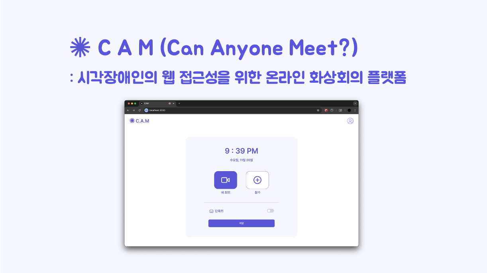

[사이트 링크](https://khucam.vercel.app/)<br/>
[데모](https://youtu.be/bUOLNlx0uss)

## 프로젝트 배경

코로나19 팬데믹 이후 비대면 실시간 화상회의 플랫폼의 이용이 급격히 증가하며, 교육과 회의의 많은 부분이 비대면으로 전환되었다. 시각장애인의 웹 접근성을 보장하기 위해 ZOOM, Google Meet와 같은 플랫폼들은 스크린 리더를 도입하였지만, 이는 시각 자료 공유를 위한 화면 공유 기능 활성화 시 적용되지 않는다. 따라서 본 프로젝트에서는 OCR(Optical Character Recognition) 기술을 활용하여 시각장애인이 공유된 화면에 대한 내용도 인지할 수 있도록 하는 온라인 화상회의 플랫폼을 개발하였다. 이를 통해 시각적 정보를 텍스트 및 음성으로 변환하여 실시간으로 제공함으로써, 시각장애인이 비대면 환경에서 원활한 학습과 업무를 수행할 수 있도록 돕는다.

## 적용 기술

1. **WebRTC**

- 브라우저 간 플러그인 없이 오디오, 비디오, 데이터 스트리밍을 실시간으로 지원하는 기술

2. **OCR (Optical Character Recognition)**

- 이미지나 스캔된 문서에서 텍스트를 인식하고 디지털 데이터로 변환하는 기술

3. **Image Captioning**

- 이미지의 내용을 이해하고 이를 자연어로 설명하는 기술

4. **TTS (Text-To-Speech)**

- 텍스트를 음성으로 변환하는 기술

## 개발 환경

- **Front-end**: TypeScript, Next.js, Tailwindcss
- **Back-end**: TypeScript, Next.js (Node.js)
- **Database**: Firebase
- **Library**: OpenVidu
- **Open API**: NCP CLOVA OCR API, OpenAI API
- **Deployment**: Vercel, AWS EC2

## 아키텍처

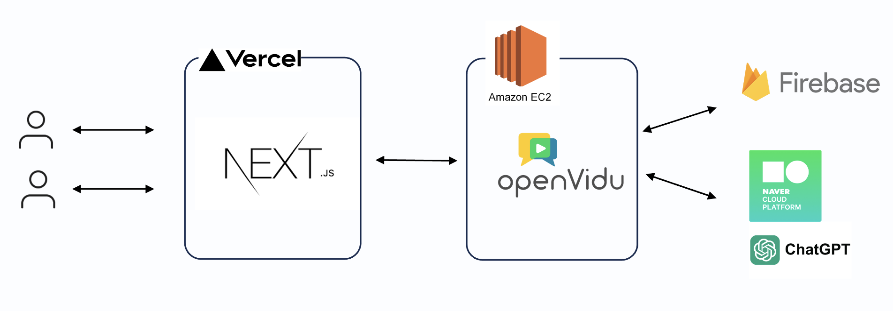

## 실행 방법

```bash
# 미디어 중개 서버 실행
$ docker run -p 4443:4443 --rm -e OPENVIDU_SECRET=MY_SECRET openvidu/openvidu-dev:2.30.0
```

```bash
# 필요 패키지 설치
$ npm i
```

```bash
# 실행
$ npm run dev
```

## 요구사항

### 1. 버전 정보

- Docker 27.2.0 (권장)
- Node v20.17.0 (권장)

### 2. API KEY 발급

- NCP CLOVA OCR API 키를 발급받으려면 [여기](https://www.ncloud.com/product/aiService/ocr), OpenAI API 키를 발급받으려면 [여기](https://platform.openai.com/settings/organization/api-keys)로 이동하세요.

### 3. Firebase Database 생성

- Firebase Database를 생성하려면 [여기](https://console.firebase.google.com/u/0/?hl=ko)로 이동하세요.

### 4. `.env` 파일 생성

- 모든 필요한 키 발급 후 프로젝트 루트 디렉토리에 `.env` 파일을 생성하여 다음과 같이 작성

```bash
NEXT_PUBLIC_FIREBASE_API_KEY='***YOUR FIREBASE API KEY***'
NEXT_PUBLIC_FIREBASE_AUTH_DOMAIN='***YOUR FIREBASE AUTH DOMAIN***'
NEXT_PUBLIC_FIREBASE_PROJECT_ID='***YOUR FIREBASE PROJECT ID***'
NEXT_PUBLIC_FIREBASE_STORAGE_BUCKET='***YOUR FIREBASE STORAGE BUCKET***'
NEXT_PUBLIC_FIREBASE_MESSAGING_SENDER_ID='***YOUR FIREBASE MESSAGING SENDER ID***'
NEXT_PUBLIC_FIREBASE_APP_ID='***YOUR FIREBASE APP ID***'
NEXT_PUBLIC_OCR_API_KEY='***YOUR OCR API KEY***'
NEXT_PUBLIC_OPENAI_API_KEY='***YOUR OPENAI API KEY***'
NEXT_PUBLIC_ENCRYPTION_KEY='***RANDOM 32 LENGTH ENCRYPTION KEY***'
```

## 프로젝트 구조

```
 📦cam/
     └📂firebase
      └📜firebasedb.js
      └📜firestore.js
     └📂public
      └📂fonts
      └📂gif
      └📂images
      └📂svgs
     └📂src
      └📂app
       └📂api
        └📂ocr
        └📂signaling
        └📂signIn
        └📂signIn
        └📂signUp
        └📂user
       └📂home
        └📜layout.tsx
        └📜page.tsx
       └📂meeting
        └📂[id]
         └📜layout.tsx
         └📜page.tsx
       └📂onBoarding
        └📜page.tsx
       └📂preview
        └📂[id]
         └📜layout.tsx
         └📜page.tsx
       └📂signIn
        └📜page.tsx
       └📂signUp
        └📜page.tsx
       └📜global.css
       └📜layout.tsx
       └📜page.tsx
      └📂components
      └📂containers
      └📂lib
        └📜blobToBase64.ts
        └📜getCaption.ts
        └📜getOcr.ts
        └📜getSpeech.ts
        └📜getText.ts
      └📜next.config.mjs
      └📜package-lock.json
      └📜package.json
      └📜tailwind.config.js
      └ ...
```

## 주요 기능

**[회원가입/로그인 페이지]**

<p align="center">
  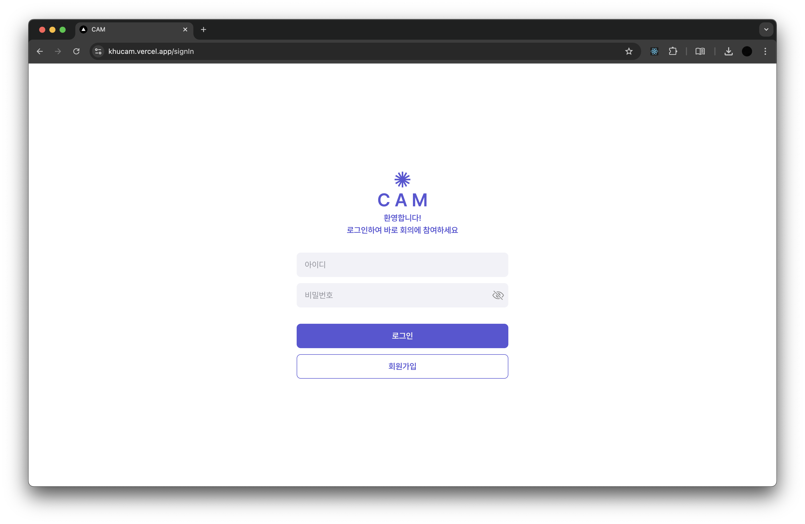
  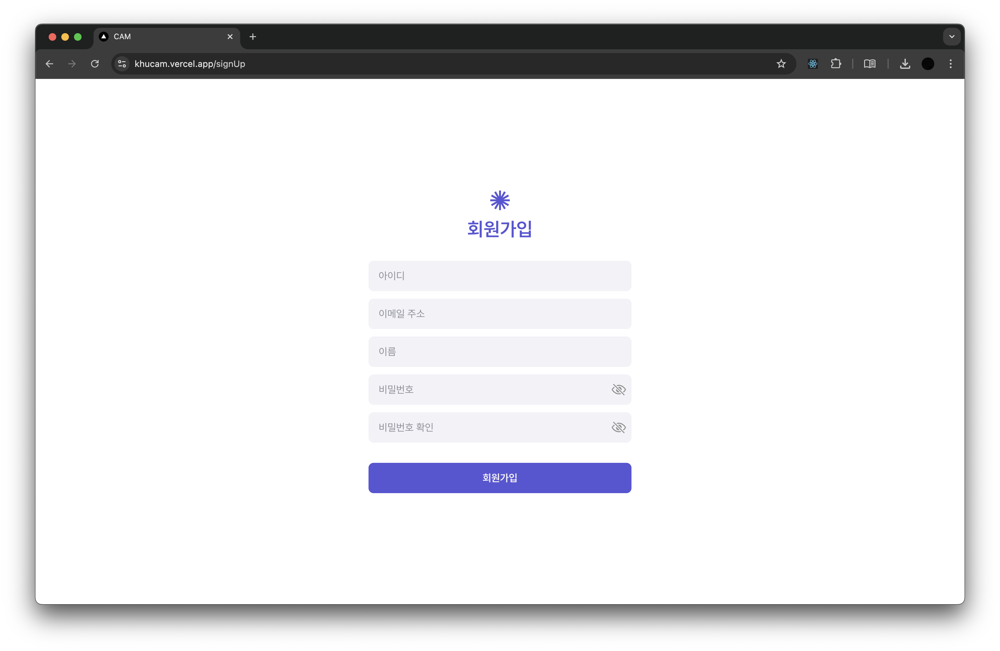
</p>

- 로그인: 아이디와 비밀번호 입력 후 서비스 이용이 가능하다.
- 회원가입: 새로운 계정 생성이 가능하다.

**[메인 페이지]**

<p align="center">
  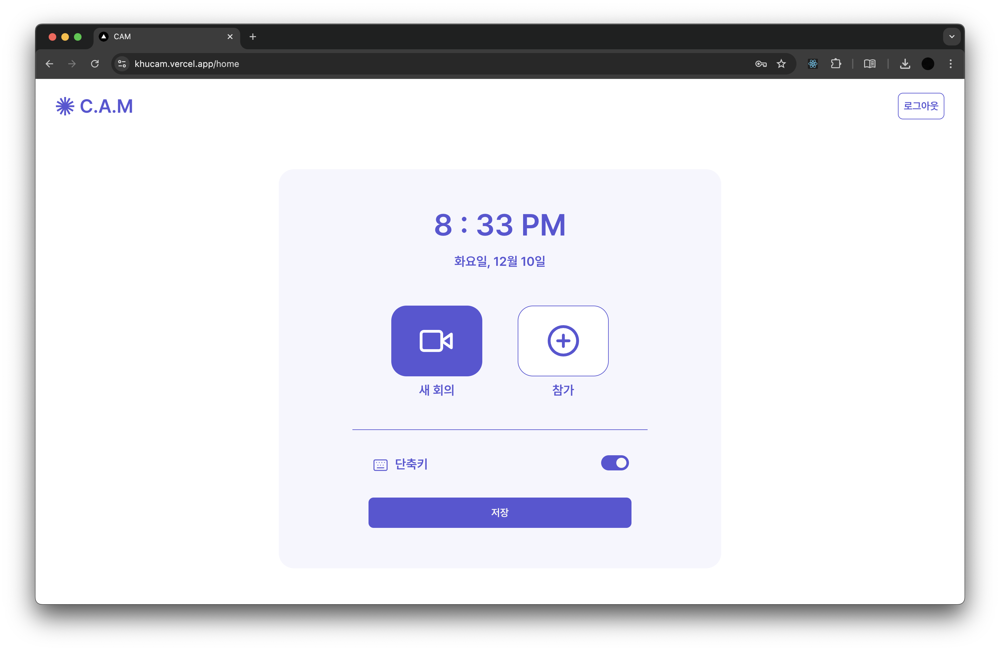
  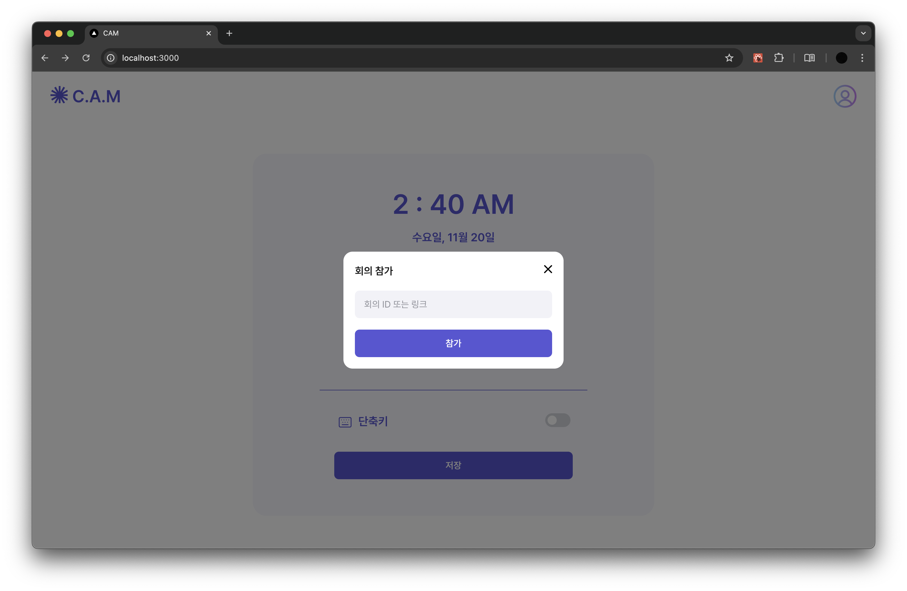
</p>

- 단축키 설정: 마우스 조작이 어려울 경우 단축키를 사용할 수 있다.
- 회의 생성: 새 회의를 생성한다.
- 회의 참가: 기 생성된 회의의 ID를 입력하여 참가한다.
- 로그아웃: 현재 로그인 된 계정에서 로그아웃이 가능하다.

**[미리보기 페이지]**

<p align="center">
  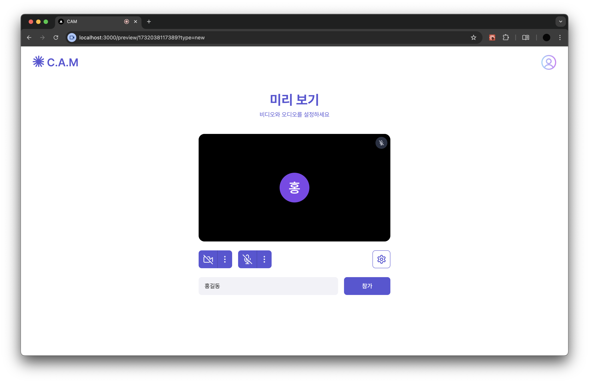
  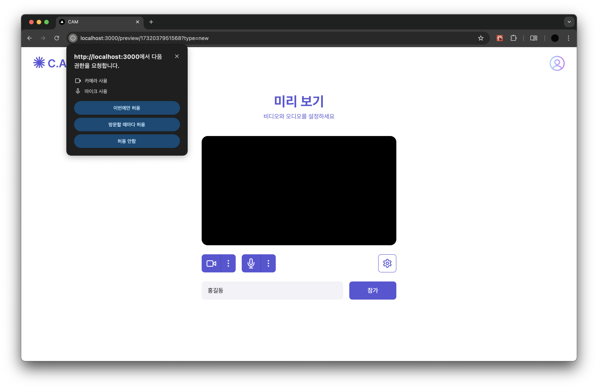
</p>

- 카메라/마이크 권한 설정: 권한을 허용해야 회의에 참여할 수 있다.
- 카메라/마이크 설정: 카메라와 마이크 기기를 선택할 수 있고 on/off 설정이 가능하다.
- 이름 변경: 회의에 참여할 이름을 설정할 수 있다.
- 참가: 회의에 참여한다.

**[회의 페이지 - 실시간 통신]**

<p align="left">
  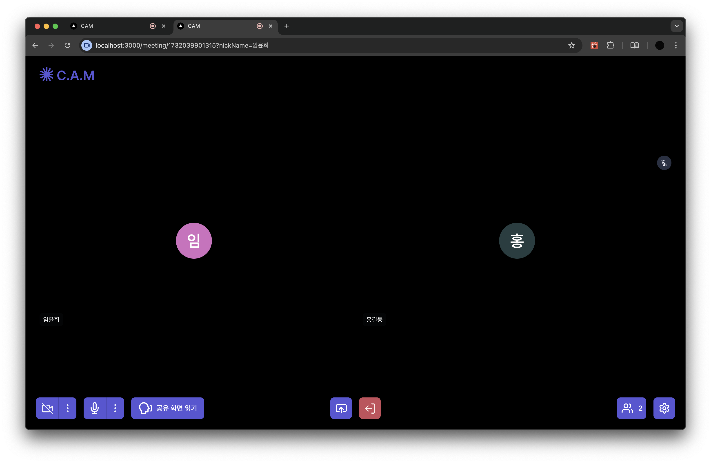
  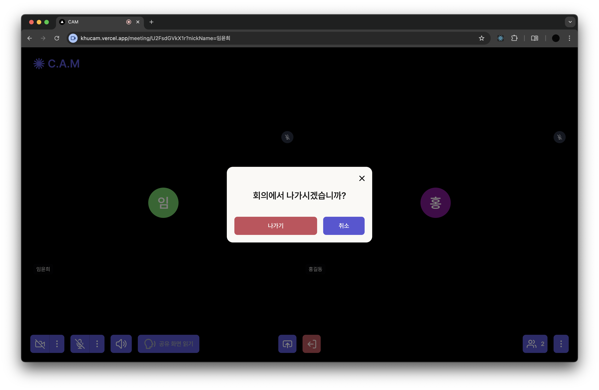

</p>

- 회의: 다수의 참여자끼리 화상 회의를 할 수 있다.
- 카메라/마이크 on/off: 카메라와 마이크를 끄고 킬 수 있다.
- 회의 나가기: 회의에서 나갈 수 있다.

**[회의 페이지 - 화면 공유]**

<p align="center">
  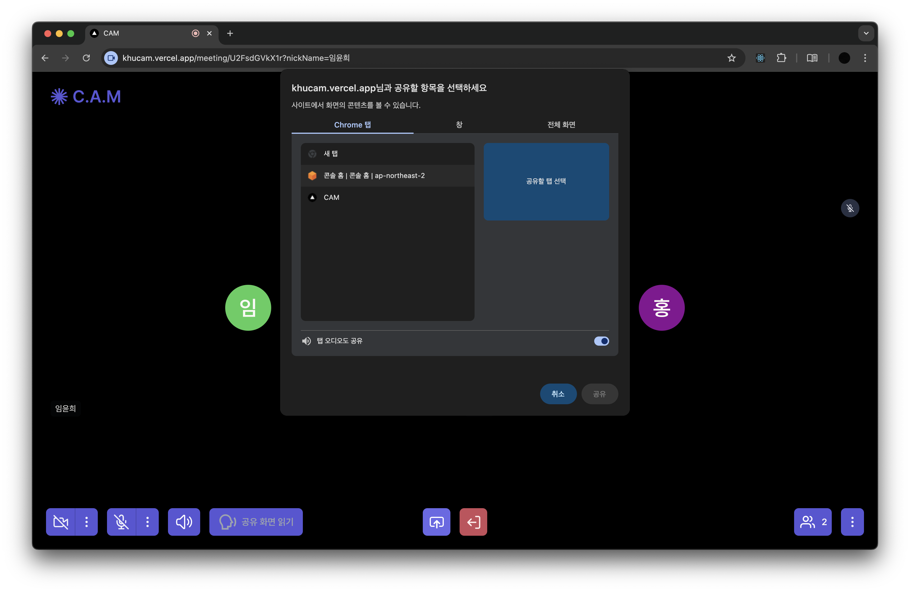
 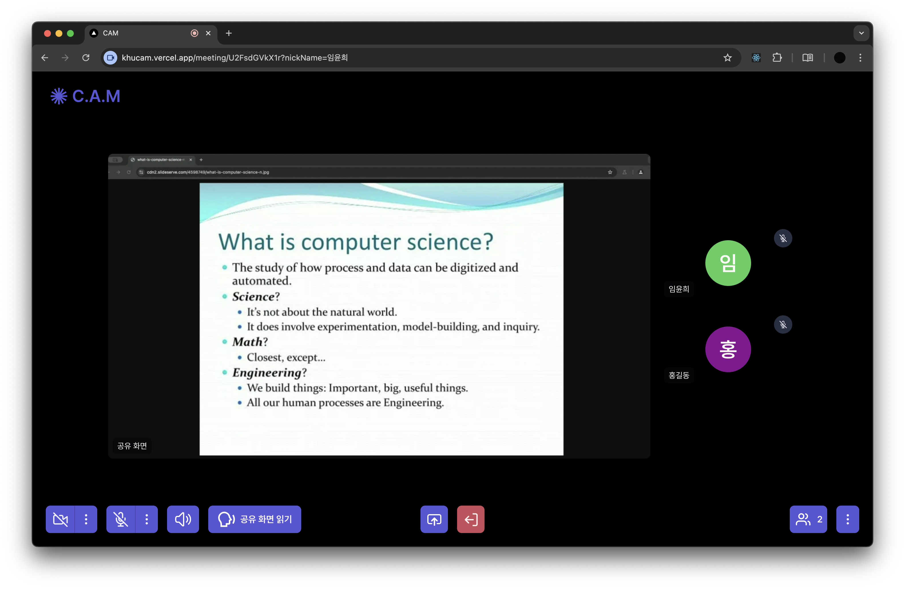</p>

- 화면 공유: 탭, 창 또는 전체 화면을 공유할 수 있다.
- 공유 화면 읽기: "공유 화면 읽기" 버튼을 클릭 시 공유된 화면의 텍스트를 음성으로 읽어주며, 자동으로 화면 변화를 감지하여 정보를 재생성한다.
- 공유 화면 읽기 중단: 공유 화면 읽기를 중단한다.
- 발화자 음소거: 발화자의 오디오를 음소거할 수 있다.
