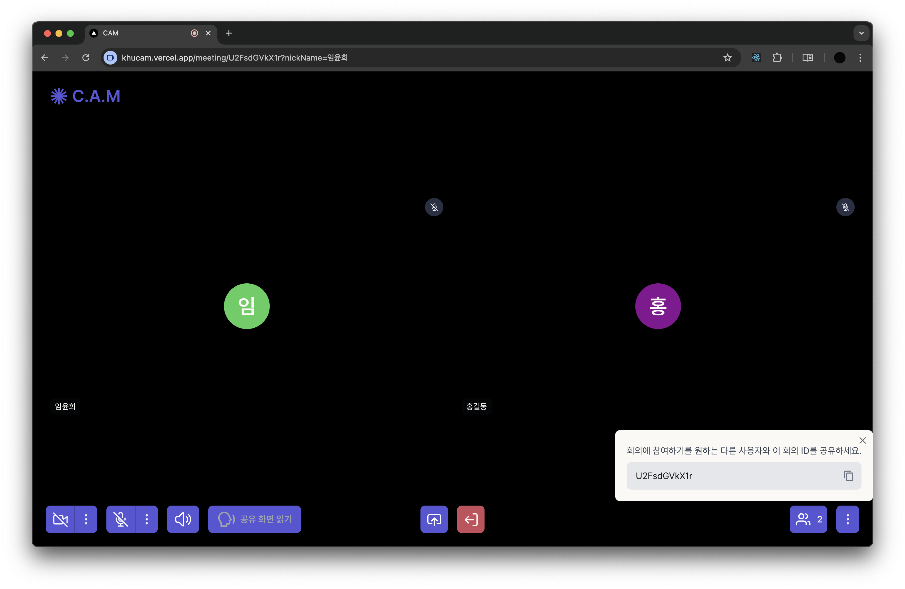

# CAM (Can Anyone Meet?)

## 프로젝트 소개

시각 장애인의 웹 접근성을 위한 온라인 화상회의 플랫폼<br/>


[데모 영상](https://www.youtube.com/watch?v=Zh_atcEjZe4)

## 프로젝트 배경

코로나19 팬데믹 이후 비대면 실시간 화상회의 플랫폼의 이용이 급격히 증가하며, 교육과 회의의 많은 부분이 비대면으로 전환되었다. 시각장애인의 웹 접근성을 보장하기 위해 ZOOM, Google Meet와 같은 플랫폼들은 스크린 리더를 도입하였지만, 이는 시각 자료 공유를 위한 화면 공유 기능 활성화 시 적용되지 않는다. 따라서 본 프로젝트에서는 OCR(Optical Character Recognition) 기술을 활용하여 시각장애인이 공유된 화면에 대한 내용도 인지할 수 있도록 하는 온라인 화상회의 플랫폼을 개발하였다. 이를 통해 시각적 정보를 텍스트 및 음성으로 변환하여 실시간으로 제공함으로써, 시각장애인이 비대면 환경에서 원활한 학습과 업무를 수행할 수 있도록 돕는다.

## 적용 기술

1. **WebRTC**

- 브라우저 간 플러그인 없이 오디오, 비디오, 데이터 스트리밍을 실시간으로 지원하는 기술

2. **TTS (Text-To-Speech)**

- 텍스트를 음성으로 변환하는 기술

3. **OCR (Optical Character Recognition)**

- 이미지나 스캔된 문서에서 텍스트를 인식하고 디지털 데이터로 변환하는 기술

## 개발 환경

- Front-end: TypeScript, Next.js, Tailwindcss
- Back-end: JavaScript, Node.js
- Library: OpenVidu

## 아키텍처


## 실행 방법

```bash
# 미디어 중개 서버 실행
$ docker run -p 4443:4443 --rm -e OPENVIDU_SECRET=MY_SECRET openvidu/openvidu-dev:2.30.0
```

```bash
# 필요 패키지 설치
$ npm i
```

```bash
# Signaling 서버 실행
$ node signaling.js
```

```bash
# client 실행
$ npm run dev
```

## 요구사항

### 1. 버전 정보

- Node v20.17.0

### 2. API KEY 발급

- API 키를 발급받으려면 [여기](https://www.ncloud.com/product/aiService/ocr)로 이동하세요.

- 발급 후 루트 디렉토리에 `.env` 파일을 생성하여 다음과 같이 작성

```bash
NEXT_PUBLIC_OCR_API_KEY='***YOUR KEY***'
```

## 프로젝트 구조

```
 📦cam/
     └📂public
      └📂fonts
      └📂images
      └📂svgs
     └📂src
      └📂api
       └📂ocr
        └📜route.ts
      └📂app
       └📜page.tsx
       └📜layout.tsx
       └📜global.css
       └📂meeting
        └📂[id]
         └📜page.tsx
       └📂preview
        └📂[id]
         └📜page.tsx
      └📂components
       └📜Button.tsx
       └📜Control.tsx
       └📜Input.tsx
       └📜Video.tsx
      └📂containers
       └📂Home
        └📜Accessibility.tsx
      └📂lib
        └📜blobToBase64.ts
        └📜getOcr.ts
        └📜getSpeech.ts
        └📜getText.ts
      └📜next.config.mjs
      └📜package-lock.json
      └📜package.json
      └📜signaling.js
      └📜tailwind.config.js
      └ ...
```

## 주요 기능

**[메인 페이지]**

<p align="center">
  
  
</p>

- 단축키 설정: 마우스 조작이 어려울 경우 단축키를 사용할 수 있다.
- 회의 생성: 새 회의를 생성한다. (단축키: 1)
- 회의 참가: 기 생성된 회의의 ID를 입력하여 참가한다. (단축키: 2)

**[미리보기 페이지]**

<p align="center">
  
  
</p>

- 카메라/마이크 권한 설정: 권한을 허용해야 회의에 참여할 수 있다.
- 카메라/마이크 설정: 카메라와 마이크 상태를 확인할 수 있다.
- 이름 변경: 회의에 참여할 이름을 설정할 수 있다.
- 참가: 회의에 참여한다. (단축키: enter)
- (뒤로가기: 왼쪽 화살표)

**[회의 페이지]**

<p align="left">
  
</p>

- 회의: 다수의 참여자끼리 화상 회의를 할 수 있다.
- 카메라/마이크 on/off: 카메라와 마이크를 끄고 킬 수 있다.
- 회의 나가기: 회의에서 나갈 수 있다. (단축키: esc)

<p align="center">
  
 </p>

- 화면 공유: 화면을 공유할 수 있다.
- 공유 화면 읽기: 해당 버튼을 클릭 시 공유된 화면의 텍스트를 음성으로 읽어준다. (단축키: ctrl+o)
