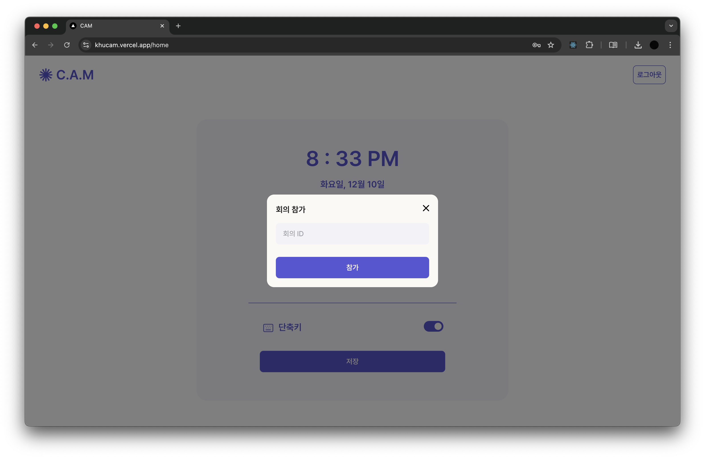
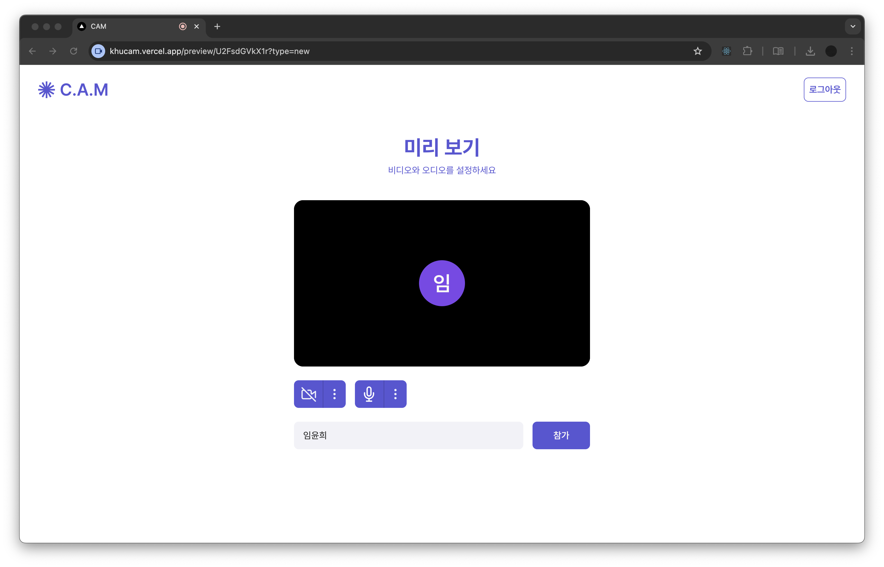

# CAM (Can Anyone Meet?)

## 프로젝트 소개

시각 장애인의 웹 접근성을 위한 온라인 화상회의 플랫폼

## 프로젝트 배경

코로나19 팬데믹 이후 비대면 실시간 화상회의 플랫폼의 이용이 급격히 증가하며, 교육과 회의의 많은 부분이 비대면으로 전환되었다. 그러나 이러한 플랫폼에서의 시각장애인의 접근성은 여전히 제한적이며, 특히 시각 자료 공유를 위한 화면 공유 기능 활성화 시 시각장애인이 이를 인지할 방법은 존재하지 않는다. 따라서 본 프로젝트에서는 OCR(Optical Character Recognition) 기술을 활용하여 시각장애인을 위한 실시간 화상회의 플랫폼을 개발하였다. 이를 통해 시각적 정보를 텍스트 및 음성으로 변환하여 실시간으로 제공함으로써, 시각장애인이 비대면 환경에서 원활한 학습과 업무를 수행할 수 있도록 돕는다.

## 적용 기술

- WebRTC
- TTS (Text-To-Speech)
- OCR (Optical Character Recognition)

## 개발 환경

- Front-end: TypeScript, Next.js, Tailwindcss
- Back-end: JavaScript, Node.js
- Library: OpenVidu

## 아키텍처


## 실행 방법

```bash
# 미디어 중개 서버
$ docker run -p 4443:4443 --rm -e OPENVIDU_SECRET=MY_SECRET openvidu/openvidu-dev:2.30.0
```

```bash
# Signaling 서버
$ node signaling.js
```

```bash
# client
$ npm i
$ npm run dev
```

## 요구사항

### 1. 버전 정보

- Node v20.17.0

### 2. API KEY 발급

- API 키를 발급받으려면 [여기](https://www.ncloud.com/product/aiService/ocr)로 이동하세요.

- 발급 후 루트 디렉토리에 `.env` 파일을 생성하여 다음과 같이 작성

```bash
NEXT_PUBLIC_OCR_API_KEY='***YOUR KEY***'
```

## 프로젝트 구조

```
 📦cam/
     └📂public
      └📂fonts
      └📂images
      └📂svgs
     └📂src
      └📂api
       └📂ocr
        └📜route.ts
      └📂app
       └📜page.tsx
       └📜layout.tsx
       └📜global.css
       └📂meeting
        └📂[id]
         └📜page.tsx
       └📂preview
        └📂[id]
         └📜page.tsx
      └📂components
       └📜Button.tsx
       └📜Control.tsx
       └📜Input.tsx
       └📜Video.tsx
      └📂containers
       └📂Home
        └📜Accessibility.tsx
      └📂lib
        └📜blobToBase64.ts
        └📜getOcr.ts
        └📜getSpeech.ts
        └📜getText.ts
      └📜next.config.mjs
      └📜package-lock.json
      └📜package.json
      └📜server.js
      └📜tailwind.config.js
      └ ...


```

## 화면 구성

**[메인 페이지]**

<p align="center">
  
  
</p>

**[미리보기 페이지]**

<p align="center">
  
  
</p>

**[회의 페이지]**

